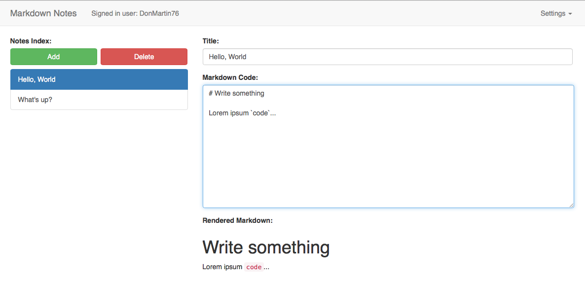

# OAuth2 Workshop

This repository contains material for an OAuth2 workshop, using wicked.haufe.io as an example implementation of an OAuth2 Identity Provider. **Note**: Most of the things are fairly generic, but some things are implemented in a somewhat opinionated manner. Keep in mind that wicked.haufe.io is just **one implementation** of the OAuth2 Standard. There are of course others, such as KeyCloak, but this workshop chose to illustrate OAuth2 using wicked.

Most labs are built up on top of each other, so it makes sense to follow them in the designed order.

If you have remarks or you have found any issues, please go ahead and file an issue on this repository. Thank you.

Martin Danielsson

## Workshop slides

The slides as presented in the workshop October 26th are here:

[oauth2_workshop_20181026.pdf](oauth2_workshop_20181026.pdf)

## The workshop subject

This workshop will be working with a very simple application called "Markdown Notes". It's a Single Page Application which allows a user to edit markdown notes and store them server side:

## Preparations

Follow the instructions: [Preparations](lab0/README.md).

## Lab 1 - Client Credentials

Lab 1 will be about the first OAuth2 flow, the Client Credentials flow, which serves to simply authenticate and authorize a client, or, an application (synonym).

[Lab 1 - Client Credentials](lab1/README.md)

## Lab 2 - Authorization Code Grant

Lab 2 will explore the Authorization Code Grant, which is probably the most well-known grant in the OAuth2 Authorization Framework. It's the most secure flow for confidential clients.

[Lab 2 - Authorization Code Grant](lab2/README.md)

## Lab 3 - Authorization Code Grant Part II

Lab 3 presents a small example application written in node.js which shows how the Authorization Code Grant works under the hood, and which requests are used when and for what purpose.

[Lab 3 - Authorization Code Grant, Part II](lab3/README.md)

## Lab 4 - Implicit Grant

Lab 4 does a deep dive into how the Implicit Grant works, including how to refresh tokens using a "silent refresh" mechanism.

[Lab 4 - Implicit Grant](lab4/README.md)

## Lab 5 - Resource Owner Password Grant

Lab 5 introduces the Resource Owner Password Grant, explains why it's usually a bad idea to use it (except under certain circumstances). The concept of "trusted clients" is introduced.

[Lab 5 - Resource Owner Password Grant](lab5/README.md)

## Lab 6 - Public Clients and PKCE

Lab 6 shows how the Proof Key Code Exchange extension to the Authorization Code Grant for Native Apps works and how it helps making Native/Mobile Apps more secure.

[Lab 6 - PKCE](lab6/README.md)
