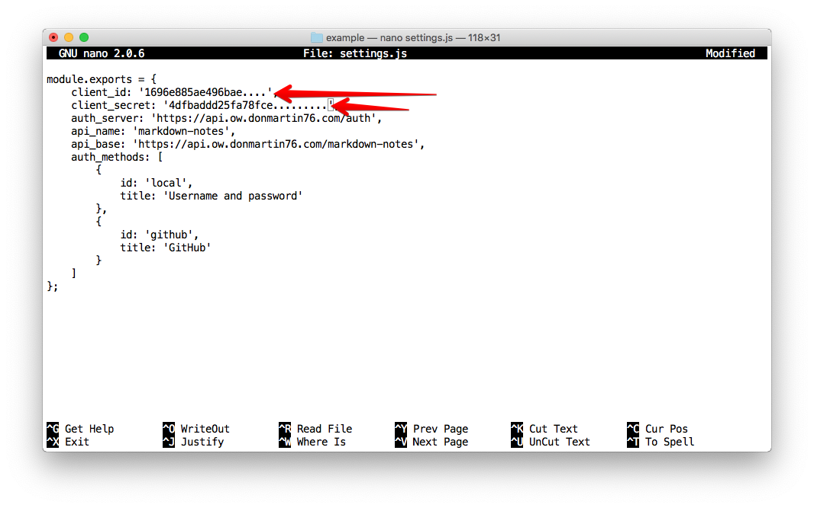
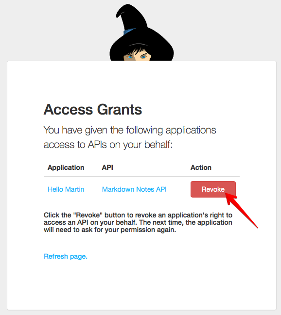

# Let's play with an example node.js application

## Aim of this Lab

In this lab, we want to get a better understanding on how the Authorization Code Flow works under the hood.

We will run a small node.js application which guides us through the different calls and how they work.

## Prerequisites

Did you clone this repository? No? OK, time to do that now:

```
user@dir$ git clone https://github.com/DonMartin76/oauth2-workshop
...
user@oauth2-workshop$ cd oauth2-workshop/lab3/example
```

Now install the dependencies for the example application:

```
user@example$ npm install
...
```

## Add your Client ID and Secret

Copy the `settings.js.template` to a new file and edit it with your favorite editor:

```
user@example$ cp settings.js.template settings.js
user@example$ nano settings.js
...
```

Add the Client ID and Client Secret from Lab 1:



Now you're ready to start the application. Do so by typing:

```
user@example$ npm start
...
```

Open the example app at [http://localhost:3000](http://localhost:3000) (open it in a new window from here).

## What does the example app do?

The example app shows how the Authorization Code Grant works with a classic web application (yes, this node.js app is a classical web application): Getting Authorization Codes, retrieving access and refresh tokens, and using these tokens to talk to the backend API.

The following sections are exercises to try out with this app.

**Note**: Before starting each exercise, **Log out** before you start. Each exercise assumes you are currently logged out when starting.

### Get an access token without scope

1. Without changing anything, just hit the "Go!" button
1. Click the link to the Authorization Server
1. Log in using username and password with the Authorization Server
1. You should be presented with a screen showing the Authorization Code
1. Click "Get me the Access Token!"
1. A screen displaying the access token is displayed. Click "Go home."
1. Click "Get profile"

Expected outcome: An error message `Forbidden, missing required scope 'read_profile'`

This is expected - we did not ask for a scope, and thus we didn't get any.

### Get an access token with the `read_profile` scope

1. Select `read_profile` in the scope list
1. Do the required steps to get an access token
1. Go back to the home page, and click "Get profile"

Expected outcome: The profile as a JSON representation.

**Note**: The authorization server did **not** ask you to authorize the access to the API; but remember that we did that in Lab 2! The Autorization remembers that decision.

### Revoke access for the application

In this exercise we want to see what the Authorization Server has stored on our user and client application combination:s

1. Log in to the application with username and password; leave the scope empty
1. Go back to the home page
1. Click the `https://api.ow.donmartin76.com/auth/local/grants` link from the home page

**Expected result:**



1. Click "Revoke"
1. Close the tab
1. Log out from the application

If you now try to log in again and request a scope on behalf of the application, the Authorization Server will ask you to confirm again.


### Play around some more in the application

Play around with the following things:

* Pass in a different/faulty `client_id`
* Pass in a different/faulty `redirect_uri`

Which security mechanisms can you make out?

You will need to use `curl` on the command line to test these things:

* Can you use a refresh token twice?
* Is the access token still valid after you have refreshed via the refresh token?

## Disclaimer

The example app is wildly bad example for how to use OAuth2. It has the following severe security flaws:

* It allows changing the client_id and redirect_uri
* In some places, it exposes its `client_secret`
* It allows altering the `code` before it's used for getting an access token
* It doesn't use a persistent session storage
* It doesn't store the refresh token in a database; the refresh token dies with the session

---
[Index](../README.md)
