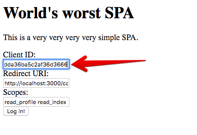
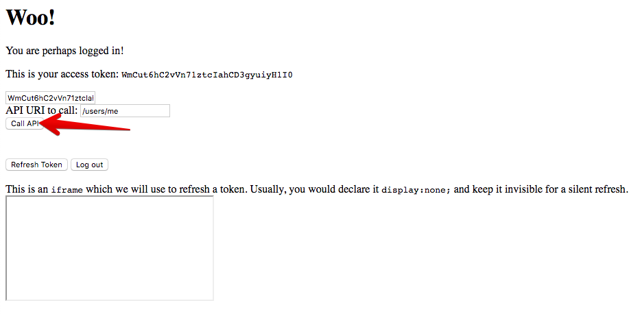
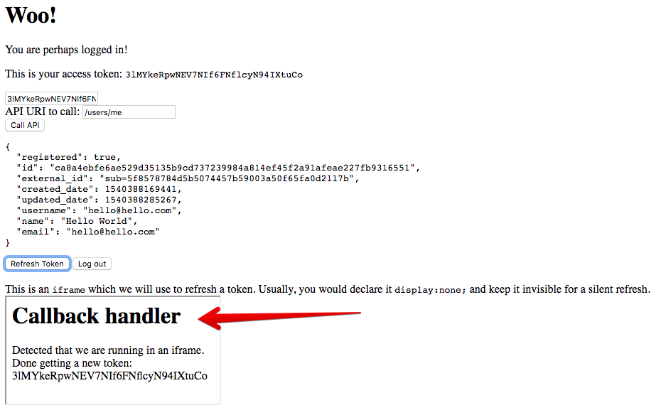

# Refreshing Tokens with the Implicit Grant

## Aim of this lab

In this lab we will look at a super simple Single Page Application and how such an Application can also refresh tokens, at least as long as the user is actively using the application.

The SPA here is a super simple application which just makes use of a few jQuery features. And that's just because it's easier.

## Prerequisites

Now we need this repository again, this time please `cd` into the `lab4/spa` directory:

```
user@oauth2-workshop$ cd lab4/spa
user@spa$ npm install -g serve
```

This installs a simple static web server which we now want to use to serve the static HTML pages which make up our SPA:

```
user@spa$ serve -l 3000
...
```

If this results in an error message, you may still have the node.js application running on the same port. If that's the case, shut down the node.js application first (Ctrl-C).

Now open up [http://localhost:3000](http://localhost:3000) in **Chrome**. This application is a little crude, and thus does currently not work as intended on other browser. This is  not an actual limitation, and I am just a little too thick to make it work there. So please, use Chrome.

## Log in to application

Paste your well known Client ID into the application:



And subsequently click on "Log in". Of course, a professional SPA would have the client ID baked in (along with the redirect URI), but that would have made it a lot more difficult for this purpose.

Depending on how much you have played around with the scopes before, you will be asked to log in and allow a couple of scopes to the application.

What happens now under the hood is that the Authorization Server again authenticates the resource owner (the end user) and calls back to the registered redirect URI. In the case of this application, this is another static web page called [callback.html](spa/callback.html). It checks for the access token in the fragment (`#access_token=...`) and then does a redirect to `app.html` (via `window.location`) after it has found the correct information. The redirect has a delay of 1000ms so that you can actually see the callback handler; usually this is almost instant.

## Try out the API

Now you're logged in and you can try out calling the API:



**Note**: This is actually calling the API via the `fetch` API **from the web page directly**. This is a single page application, and *there is no backend* which could do the calls. We're using `fetch` here, which is the more modern variant of "Ajax".

1. Call the `/users/me` end point, copy the `id` of the logged user
1. Call e.g. the `/users/<id>/index` end point to get a list of notes
1. Then you might want to call `/notes/<note id>` to retrieve a single note

## Refreshing the Token

If everything works alright, we can try to refresh the access token.

Click the "Refresh" button. The expected outcome should be that the access token is refreshed, and no error messages are displayed:



**Remember**: There is no such thing as a refresh grant for the implicit grant, so instead we do the following thing:

1. We use an `<iframe>` tag, usually a hidden one
1. We re-do the authorization step, just like for the initial login, but adding a parameter `&prompt=none`
1. Then we set the `src` of the `iframe` to fire it off
1. The authorization flow will return with a new `#access_token=...` to the callback handler, **inside the `iframe`**
1. The `callback.html` page inside the `iframe` updates the access token inside the HTML5 `localStorage`

Tada! We have an refreshed token.

### Wait, what?

Looks like magic, but it's actually not. Let's go back to the slides.

---
[Index](../README.md)
