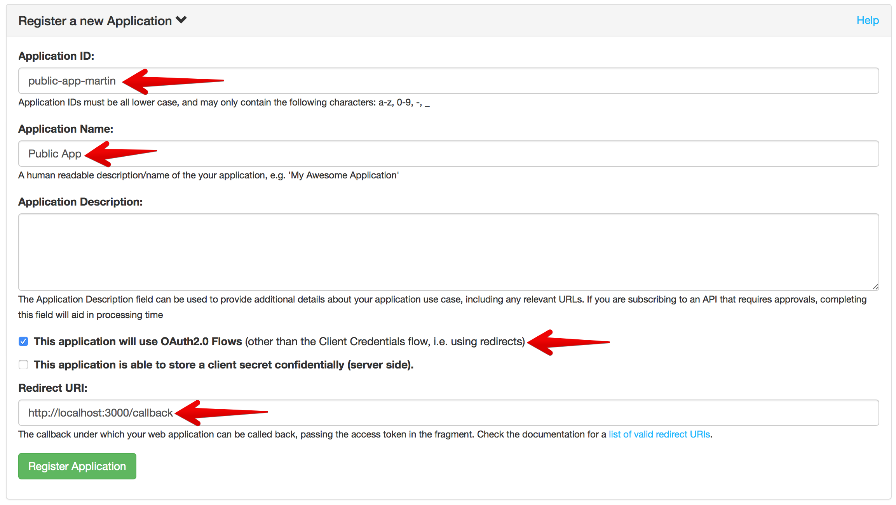
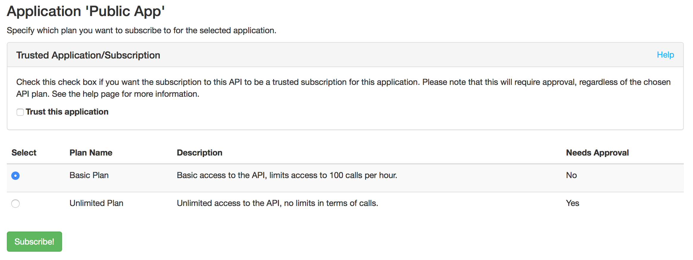
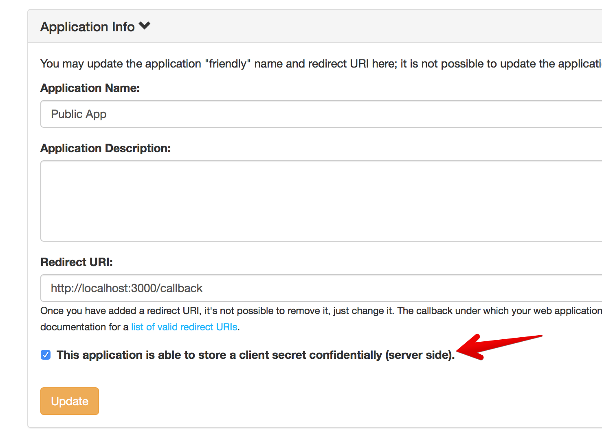

# PKCE Extension of the Authorization Code Grant

## Aim of this lab

We want to find out how PKCE (Proof Key Code Exchange, pronounced "pixy") works in combination with the Authorization Code Grant.

This is the preferred way for mobile native applications (iOS, Android,...) to authorize access to resources.

## Register a new public application

You have done it a couple of times before, now create another new application, this time configured as a public application (non-confidential):



Once more, create a subscription for the Markdown Notes API, this time a non-trusted one:



Go into the `lab6/scrips` directory and create a `settings.json` by copying the `settings.json.template`; open it with a text editor and enter Client ID and Client Secret from the APi subscription into this file.

## Generate an authorize URL

Now open a command line, e.g. bash or Powershell; the main thing is that you need access to the `node` command. Go into the `lab6/scripts` subdirectory of the `oauth2-workshop` repository (which you really should have cloned to your local computer by now):

```
martind@scripts$ node make_authorize_url.js
...
```

The script will generate a URL which should be pasted into a web browser in anonymous mode.

The URL has a couple of specialties, when comparing to the plain authorize URL from the non-extended Authorization Code Grant version:

* Additional parameter `code_challenge`
* Additional parameter `code_challenge_method`

Now open the script [make_authorize_url.js](scripts/make_authorize_url.js) and see what happens here:

1. The script creates a `code_verifier`, which is a fairly long random string
1. The `code_verifier` is hashed with SHA256 and turned into `base64` representation
1. The result of this is called `code_challenge`, and is passed along with the other authorize request

The `code_challenge_verifier` is always set to `S256` to show that SHA256 is used; in principle `plain` is also allowed, but using `plain` does not help against the threat models PKCE actually wants to mitigate.

The script also stores the `code_verifier` and the `code_challenge` into a file called `code_challenge.json` in the current directory; this is usually stored in the native apps local storage, in a place which is only accessible for the local application.

Now paste the URL into a browser in anonymous mode; authenticate and subsequently authorize the application for accessing the API on behalf of the Resource Owner (the user). You will be redirected to `http://localhost:3000?code=...` from where you can copy/paste the authorization code.

## Obtain an access token

Now we want to use the `code`, the `code_verifier` and the `client_id` to obtain a token via the `/token` endpoint. This is done via the little script `make_curl_command.js` which can be called like this:

```
martind@scripts$ node make_curl_command.js <code>
...
```

The output of this script is a `curl` command line which shows how the token can be obtained, reading the client credentials from `settings.json` and the (temporary) `code_verifier` from `code_challenge.json`.

Copy/paste the `curl` command, and you should be able to retrieve an access token.

## Things to try out (security mechanisms)

* What happens if you also pass in the `client_secret` when getting the token?
* In which way does the Authorization Server's behavior change if you tick the "Confidential" check box for your application?



* Can you still use PKCE?

## How does this mitigate things?

This works like an extended CSRF protection. 

Imagine a malicious application hijacking the redirect URI; it will still not be able to use the authorization code, as it does not know the `code_verifier`.

Likewise, if the client application receives a redirect which it does not expect, it will not have a `code_verifier` in its local storage, and can immediately detect that something is not right.

---
[Index](../README.md)
